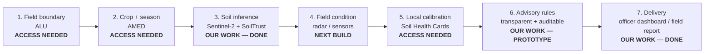
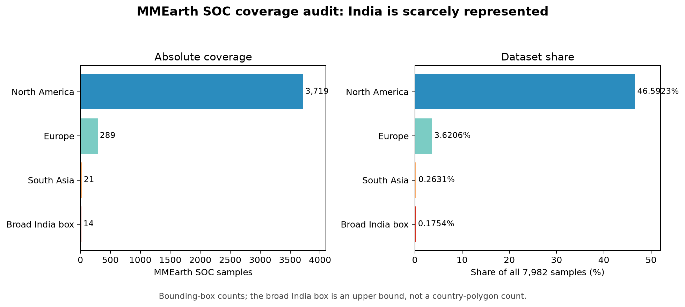
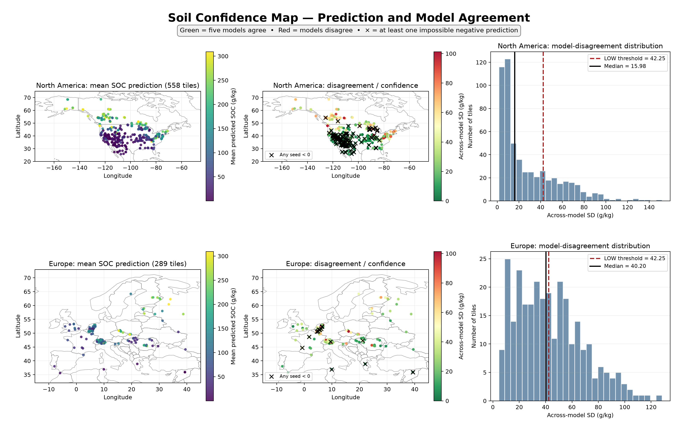
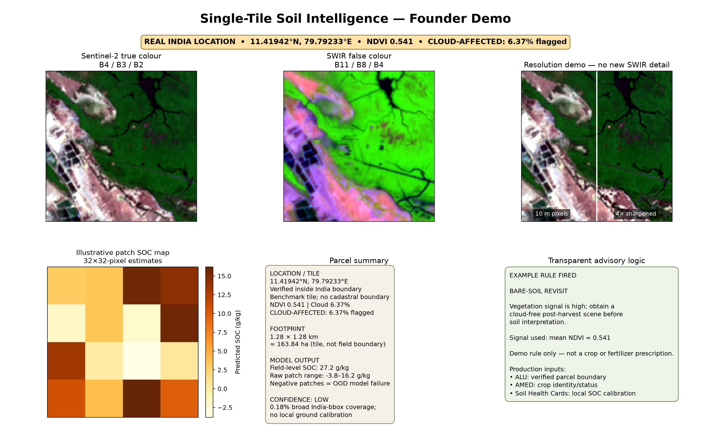
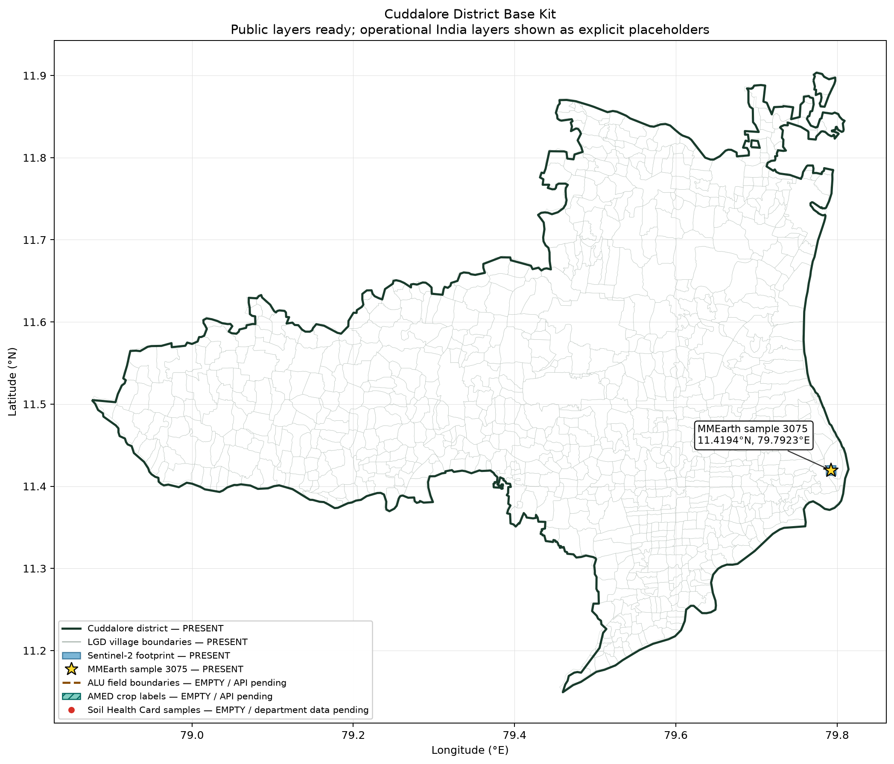

# SoilTrust

> **The soil intelligence map that tells you where to trust it—and where to send ground samples instead.**

SoilTrust is an evidence-first prototype for district soil intelligence. It combines multispectral satellite imagery with ground observations, produces soil organic carbon (SOC) estimates, and exposes model disagreement as a sampling-priority layer. The objective is not another uniformly confident map: it is a practical decision system for spending a limited field-sampling budget.

## The Problem

- The Baramati model demonstrates what data-rich precision agriculture can do, but the supplied project context puts its cost near **₹75,000 per farmer** and notes its dependence on foreign cloud infrastructure. That is context for this product direction, not a result measured in this repository.
- Only **14 of 7,982 samples (0.1754%, approximately 0.18%)** in the global MMEarth SOC benchmark fall inside a broad India bounding box—and only two were inside the coarse country polygon used in the follow-up audit. See [the measured coverage audit](./docs/01-problem.md).
- A model can perform inside a data-rich training geography and fail after crossing a continent. Our North-America-trained models did exactly that in Europe.

The implication is straightforward: India needs local calibration, and every prediction product needs an explicit indication of where the model is unsupported.

## The Pipeline

The seven layers separate authoritative inputs from learned inference. Missing ALU, AMED, or Soil Health Card data is never silently replaced with a fabricated layer. [Read the full pipeline](./docs/02-pipeline.md).

## What We Built

### 1. India coverage audit

**Honest finding:** the broad India box contains 14 benchmark points—0.1754% of 7,982—and is itself an upper bound because it includes neighbouring territory.

### 2. Continental transfer and confidence map

**Honest finding:** five models trained in North America agree much less in Europe; median disagreement rises from 15.98 to 40.20 g/kg.

### 3. Single-location field report card

**Honest finding:** this is a real India location and an inference demonstration, but the 163.84 ha image tile is not a verified farm parcel; negative patch outputs remain visible as failure evidence.

### 4. Interactive SoilTrust dashboard

[Open the standalone interactive dashboard](./dashboard/soiltrust_dashboard.html) by downloading or opening the HTML in a browser. It turns model disagreement into an officer-facing ground-sampling worklist. GitHub may display HTML source rather than execute it directly.

### 5. Cuddalore district base

**Honest finding:** the public base contains one valid district polygon, 870 village polygons, and the real sample-3075 Sentinel-2 footprint. ALU, AMED, and Soil Health Card layers are explicitly empty pending access.

## Key Results

| Question | Measured result | Meaning |
|---|---:|---|
| Within North America | Deep RMSE **117.992** vs baseline **146.435 g/kg** | **19.42% lower RMSE**; the model learned useful in-region signal |
| North America → Europe | Deep RMSE **139.152 ± 15.779** vs baseline **128.870 g/kg** | **7.98% worse than the mean baseline**, with seed-sensitive transfer |
| Europe transfer R² | **−0.2216 ± 0.2759** | Worse than predicting Europe's own mean on average |
| Confidence shift | Median disagreement **15.978 → 40.196 g/kg** | Confidence degrades **2.52×** outside the training region |
| Low-confidence coverage | **25.09%** in-region vs **45.33%** in Europe | Ground-sampling demand rises under geographic shift |

Raw predictions are **uncalibrated** and some are physically impossible (negative SOC). They are shown, not clipped. That is precisely why SoilTrust treats confidence as a product layer rather than decorative metadata. See [experiments](./docs/03-experiments.md) and [complete results](./docs/04-results.md).

## Current Status

- Cuddalore public base ready: district boundary, **870 villages**, verified sample-3075 anchor, and its Sentinel-2 footprint.
- Soil inference, five-seed disagreement mapping, parcel-style reporting, and a standalone decision dashboard are implemented.
- Pending: ALU parcel-boundary access, AMED crop/season access, and one district's geolocated Soil Health Card laboratory observations.

## Honest Limitations

- The benchmark has only **0.18% broad-box India coverage**. This is not an India-calibrated model and its outputs are not an India accuracy claim.
- Some raw outputs are negative and therefore physically impossible. The demonstrations preserve those failures because hiding them would overstate readiness.
- Agreement is useful evidence of stability, but not proof of accuracy: five models may share one bias.
- The current tile prediction is image-level. Patch inference illustrates mechanics, not validated within-field resolution.
- Reliable bare-soil inference needs a cloud-screened, multi-date Sentinel archive chosen around crop and soil visibility. A sharpened RGB image cannot create new 10 m SWIR chemistry.
- MMEarth soil labels are CC BY-NC. Commercial deployment requires client-owned or appropriately licensed calibration data and a licensing review.

## How to Read This Repo

1. Start with [01 — The India data gap](./docs/01-problem.md).
2. Follow the operational design in [02 — The seven-layer pipeline](./docs/02-pipeline.md).
3. Review evaluation design in [03 — Experiments](./docs/03-experiments.md).
4. Inspect every headline number and caveat in [04 — Results](./docs/04-results.md).
5. Finish with [05 — Roadmap and access requirements](./docs/05-roadmap.md).

The [`notes/`](./notes/) directory preserves the raw run narratives and tables. [`code/`](./code/) contains the actual scripts; checkpoints and raw imagery are intentionally excluded. [`data/cuddalore/`](./data/cuddalore/) contains only small, public boundary and anchor GeoJSON files.

