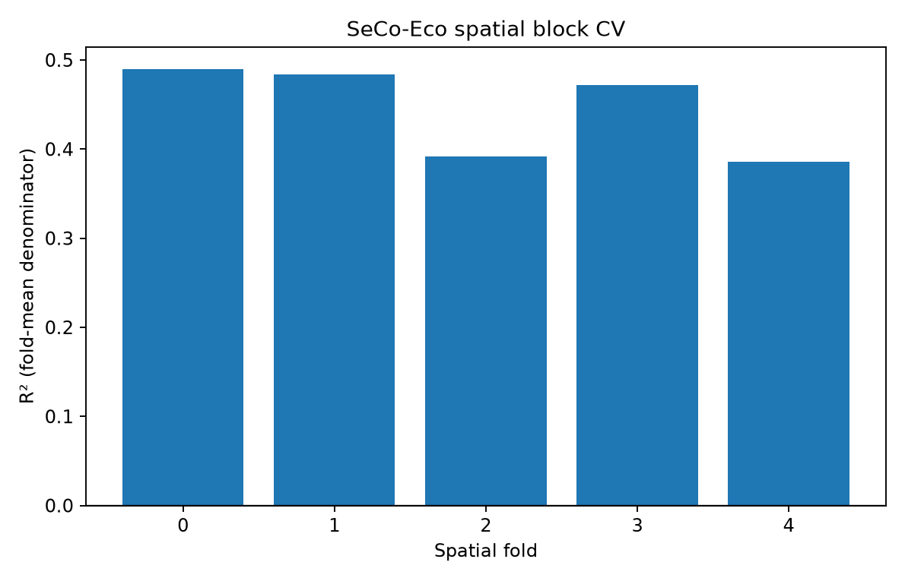

# 04 — Results

## Decision summary

| Evaluation | Deep model | Comparator | Result |
|---|---:|---:|---|
| North America spatial holdout RMSE | 117.9920 ± 1.8772 g/kg | 146.4347 g/kg mean baseline | Deep model is 19.42% lower |
| North America spatial holdout R² | 0.3342 ± 0.0211 | −0.0253 | Useful in-region signal |
| Europe transfer RMSE | 139.1520 ± 15.7792 g/kg | 128.8704 g/kg mean baseline | Deep model is 7.98% higher |
| Europe transfer R² | −0.2216 ± 0.2759 | −0.0370 | No reliable average transfer skill |
| Europe individual-seed R² range | −0.5750 to 0.0861 | — | High run-to-run instability |

The negative Europe baseline R² is expected: it predicts the North America training mean, while the R² denominator uses Europe's own mean. Values are never clipped.

## Confidence as a sampling signal

| Quantity | North America holdout | Europe transfer |
|---|---:|---:|
| Tiles | 558 | 289 |
| Median five-model disagreement | 15.978 g/kg | 40.196 g/kg |
| Above the in-region low-confidence threshold | 25.09% | 45.33% |
| Any seed predicts negative SOC | 25.27% | 5.54% |
| Ensemble mean is negative | 2.87% | 0.35% |

Median disagreement increases by **2.52×** outside the training geography. The negative-output rates do not move in the same direction, which is an important reminder that different failure indicators capture different problems.

## Spatial validation context

Across five block-CV control models, the never-touched geographic holdout produced MAE **20.8772 ± 1.3511**, RMSE **41.5084 ± 0.7919**, R² **0.0784 ± 0.0351**, and bias **−3.6727 ± 3.4774 g/kg**. The pooled out-of-fold spatial-CV R² was 0.4472, showing why the dedicated remote holdout must remain the client-facing measure of unmapped-region performance.

## Uncertainty baseline result

The proposed deep quantile experiment was stopped by its predefined South Asia representation gate. An auditable tabular quantile baseline was still run. On its geographic holdout, Duan-corrected median predictions averaged R² **−0.1940 ± 0.0725** and 5–95% interval coverage **0.5366 ± 0.0305**, far below the nominal 0.90 target. This is reported as miscalibration, not tuned away.

## What these numbers do—and do not—support

They support three claims: the vision model learns signal in its training continent; that skill does not transfer reliably to Europe; and seed disagreement rises strongly out of region. They do **not** support an India accuracy claim, field-scale mapping claim, or calibrated agronomic recommendation.

Source tables: [`continental_transfer.csv`](../notes/results/continental_transfer.csv), [`spatial_cv_results.csv`](../notes/results/spatial_cv_results.csv), [`confidence_summary.json`](../notes/results/confidence_summary.json), and [`tabular_log_quantile_results.csv`](../notes/results/tabular_log_quantile_results.csv).

